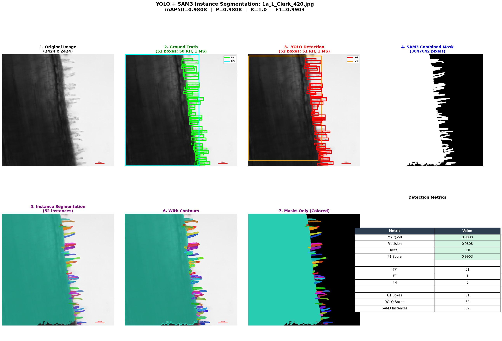
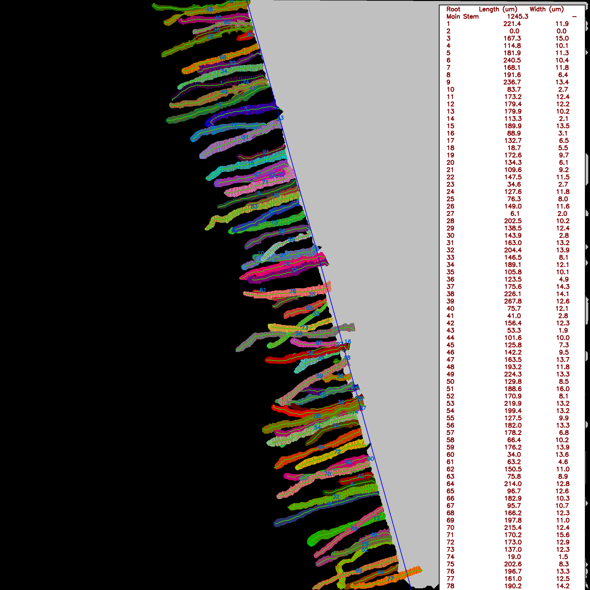
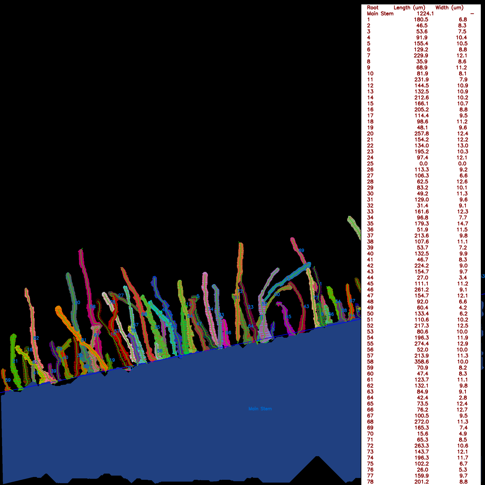
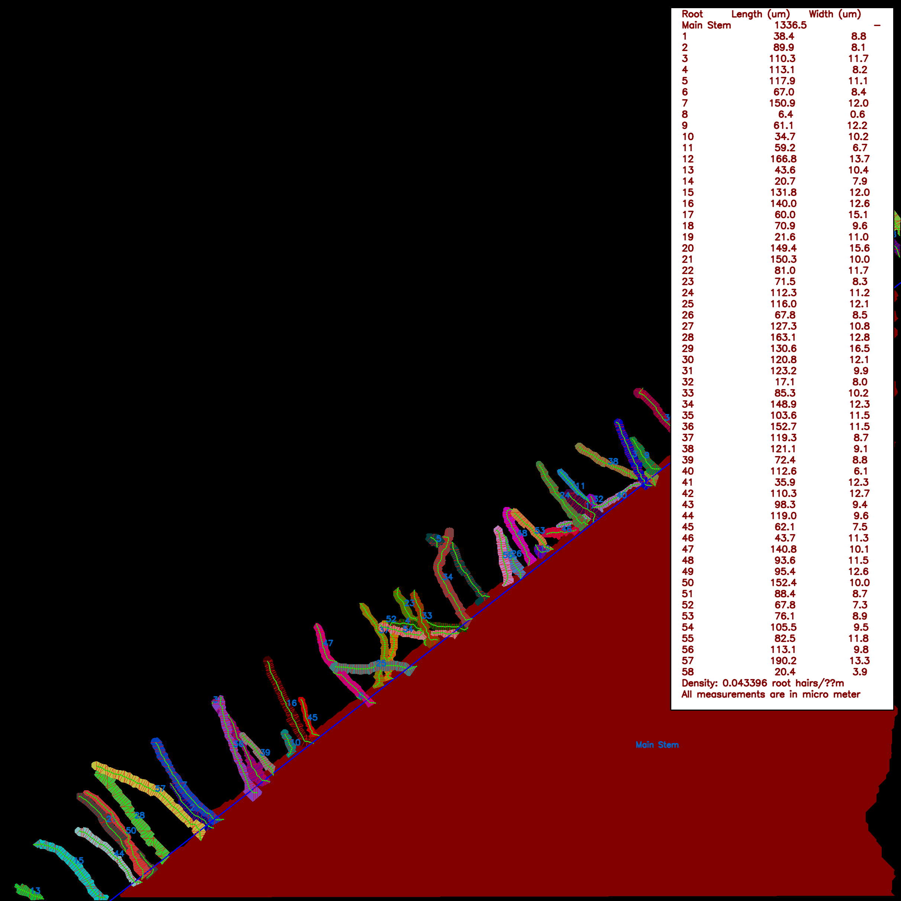

<p align="center">
  
</p>

<div align="center">

# microRoots

### microRoots: A Measurement-Oriented Soybean Root-Hair Phenotyping Framework Based on GenAI-Assisted Active Learning and Detector-Prompted Segmentation

</div>


**microRoots** is a soybean root-hair phenotyping framework that converts microscopy images into quantitative, instance-level root-hair traits.


---

## microRoots Pipeline

<p align="center">
  
</p>

---

## Repository structure

```text
microRoots/
├── README.md
├── requirements.txt
├── environment.yml
├── pyproject.toml
├── .gitignore
├── configs/
│   ├── inference_config.yaml
│   └── model_paths.yaml
├── docs/
│   ├── installation.md
│   ├── usage.md
│   ├── model_weights.md
│   ├── sam3_setup.md
│   ├── github_browser_upload.md
│   └── troubleshooting.md
├── weights/
│   └── README.md
├── examples/
│   ├── input_images/
│   ├── output_masks/
│   └── measurement_results/
├── scripts/
│   ├── download_weights.py
│   ├── run_segmentation.py
│   └── run_measurement.py
├── src/
│   └── micro_roots/
│       ├── detection/
│       ├── segmentation/
│       ├── pipeline/
│       ├── measurement/
│       └── utils/
└── legacy/
    └── original_user_scripts/
```

---

## Required model weights

The trained weights are hosted externally on Google Drive.
Download both files from Google Drive and place them in the `weights/` folder.

| Model | Required file name | Purpose |
|---|---|---|
| YOLOv12x + CBAM | `last.pt` | Detects root-hair and main-stem candidate boxes |
| Fine-tuned SAM3 | `FinalFT.pt` | Generates box-prompted instance masks |

Links are provided in [`weights/README.md`](weights/README.md) and [`docs/model_weights.md`](docs/model_weights.md).

Expected final structure:

```text
weights/
├── README.md
├── last.pt
└── FinalFT.pt
```


---

## Installation

A CUDA-capable GPU is recommended for YOLO + SAM3 inference.

```bash
conda create -n microRoots python=3.10 -y
conda activate microRoots
pip install -r requirements.txt
pip install -e .
```

SAM3 must also be installed or provided locally. See [`docs/sam3_setup.md`](docs/sam3_setup.md).

---

## Quick start

### 1. Add input images

Put microscopy images in:

```text
examples/input_images/
```

Supported formats:

```text
.jpg, .jpeg, .png, .tif, .tiff
```

### 2. Run YOLOv12x-CBAM + SAM3 segmentation

```bash
python scripts/run_segmentation.py \
  --input examples/input_images \
  --output outputs/segmentation \
  --yolo-weights weights/last.pt \
  --sam3-weights weights/FinalFT.pt \
  --sam3-root external/sam3 \
  --device cuda
```

Expected outputs:

```text
outputs/segmentation/
├── detections/
│   └── all_detections.json
├── masks/
│   └── *_mask.png
├── overlays/
│   └── *_overlay.jpg
├── metadata/
│   └── *_instances.json
└── summary.json
```

### 3. Run root-hair trait measurement

```bash
python scripts/run_measurement.py \
  --mask-dir outputs/segmentation/masks \
  --metadata-dir outputs/segmentation/metadata \
  --output results/traits.csv \
  --per-instance-output results/per_instance_traits.csv \
  --annotated-dir results/annotated_measurements
```

Expected outputs:

```text
results/
├── traits.csv
├── per_instance_traits.csv
└── annotated_measurements/
    └── *_measurement.png
```

---

## Measurement traits


The trait-extraction module converts instance-level segmentation outputs into biologically relevant soybean root-hair phenotyping traits.

| Phenotypic trait | Operational definition |
|---|---|
| Main-root length | Length of the main root axis from the root-hair-bearing boundary of the main root and extended to the image field of view. |
| Root-hair count | Total number of instance root hairs in each microscopy image. |
| Root-hair length | Geodesic skeleton length of each individual segmented root-hair instance. |
| Root-hair width | Perpendicular width of each individual segmented root-hair instance estimated through skeleton-based width sampling. |
| Mean root-hair length | Average root-hair length calculated across all segmented root-hair instances in an image. |
| Mean root-hair width | Average root-hair width calculated across all segmented root-hair instances in an image. |
| Root-hair density | Number of root-hair instances normalized by main-root length. |


Default pixel-to-micron conversion factor:

```text
0.495 μm/pixel
```

This value can be changed in `configs/inference_config.yaml` or passed directly to the measurement script.

---

## Important notes

- The measurement code expects **color-coded instance masks**.
- Black pixels are treated as background.
- The segmentation pipeline also writes metadata JSON files, which help the measurement module identify `RH` and `MS` instances.
- If metadata is unavailable, the measurement module assumes that the largest colored instance is the main stem.

---

## Example Output

The figure below shows an example output generated by the microRoots pipeline in detail, including the final segmentation/measurement visualization.

<p align="center">
  
</p>

<p align="center">
  <b>Example output from the microRoots soybean root-hair phenotyping pipeline.</b>
</p>


## Visual Example of Trait Measurement

The following examples show annotated outputs from the "microRoots".

<table>
  <tr>
    <td align="center" width="33%">
      
    </td>
    <td align="center" width="33%">
      
    </td>
    <td align="center" width="33%">
      
    </td>
  </tr>
</table>


## Citation

Coming Soon


